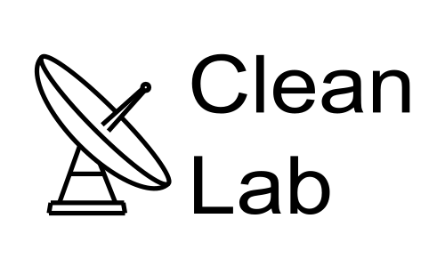

<p align="center">
  
</p>


# CleanLab
*A modular laboratory for radio interferometric deconvolution.*

CleanLab is a flexible Python code implementing multiple variants of the CLEAN algorithm, from classic Clark CLEAN to spectral and parallel multi-peak approaches.
It allows experimenting with peak detection, gain functions, and residual update strategies for both 2D images and 3D spectral cubes.

The implementation of these algorithms is based on the original Högbom and Clark CLEAN algorithms:

- Högbom, J. A. (1974). *Aperture Synthesis with a Non-Regular Distribution of Interferometer Baselines*.  
  **Astronomy and Astrophysics Supplement Series**, 15, 417.  
  [ADS link](https://ui.adsabs.harvard.edu/abs/1974A%26AS...15..417H/abstract)

- Clark, B. G. (1980). *An Efficient Implementation of the Algorithm 'CLEAN'*.  
  **Astronomy and Astrophysics**, 89, 377.  
  [ADS link](https://ui.adsabs.harvard.edu/abs/1980A%26A....89..377C/abstract)

## Example Usage

After installing the required dependencies:

```bash
pip install numpy scipy matplotlib astropy tqdm tabulate

python run_clean.py \
  --dirty_image images/dense.fits \
  --psf wsclean-psf.fits \
  --threshold 2.0 \
  --max_iter 1000 \
  --mode clark \
  --mask none \
  --iter_per_cycle 100 \
  --show_plots \
  --print_results \
  --gain 0.2 \
  --peak_detection regular \
  --debug_results
```

---

### 📚 Documentation

For full details, visit the [docs](docs/) directory:

- [Overview](docs/overview.md)
- [Installation Guide](docs/installation.md)
- [Usage Examples](docs/usage.md)
- [Algorithms](docs/algorithms.md)
- [API Reference](docs/api_reference.md)

